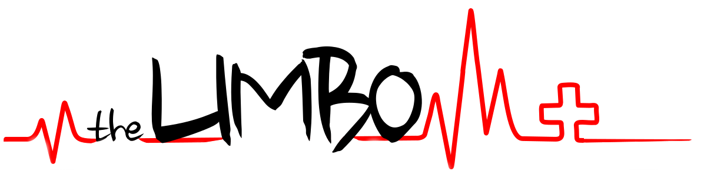
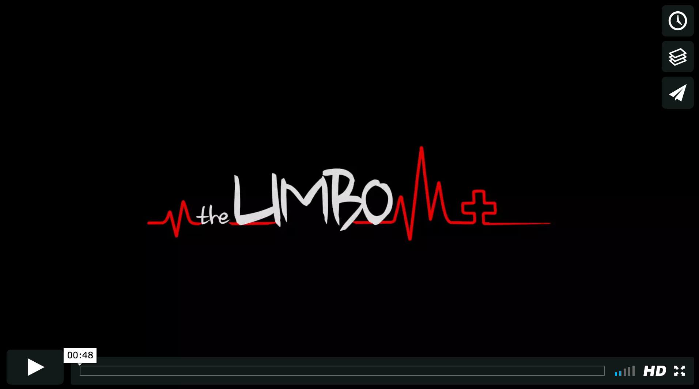
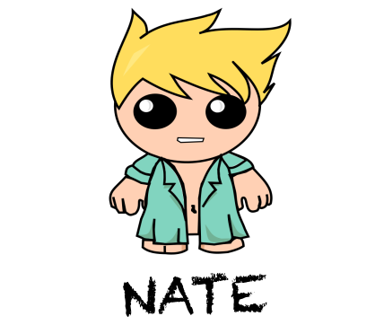
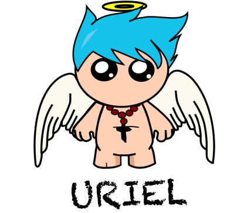
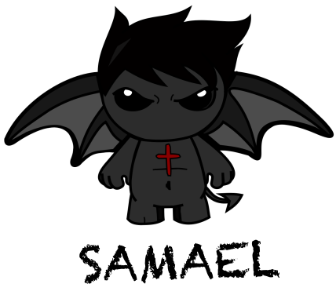
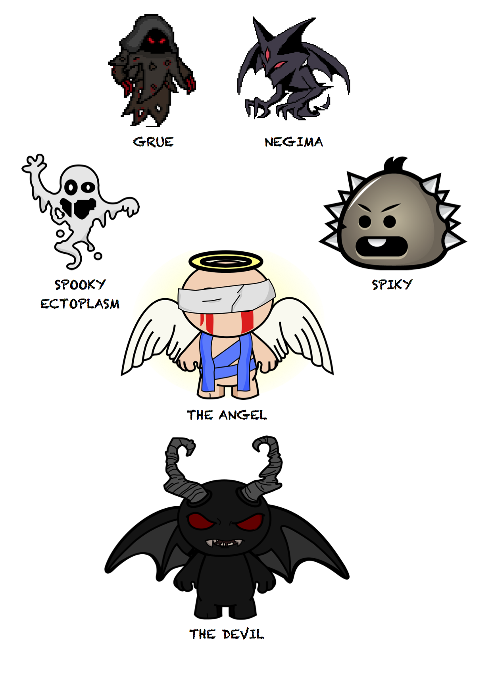
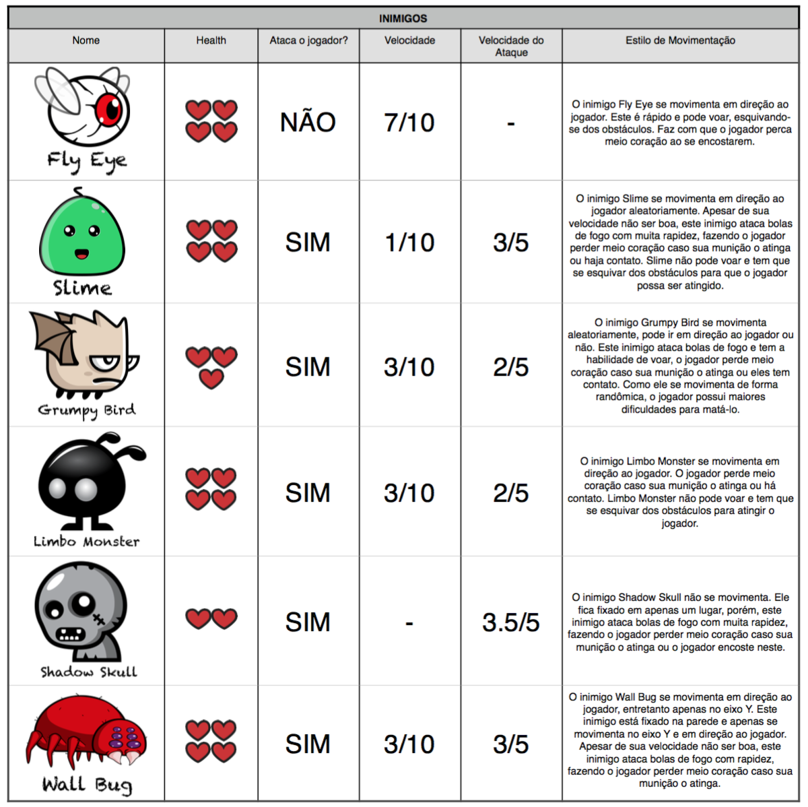
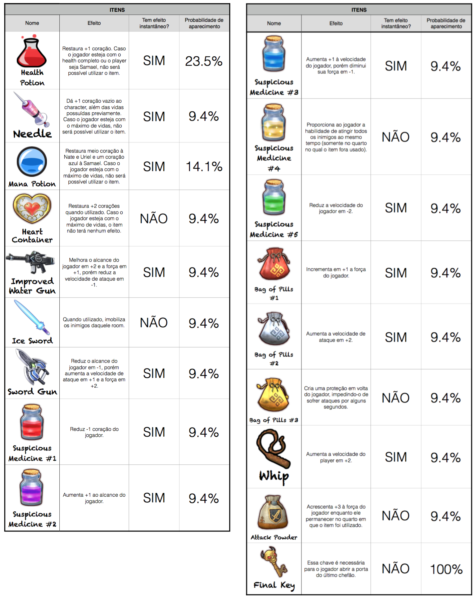

## The Limbo
**By [Amanda Fernandes](https://github.com/amandafer/)** 
*Federal University of Minas Gerais, 2016.*

*The Limbo is a game based on Binding of Isaac. It was developed using Unity 3D and the characters designed using Inkscape. The game is available for Mac and Windows platforms.*

### Table of Contents
- [Introduction](#introduction-)
  * [How to Download](#download-)
  * [About](#about-)
- [Trailer](#trailer)
- [Characters](#characters-)
  * [Main Characters](#main-characters-)
  * [Bosses](#bosses-)
  * [Enemies](#enemies-)
- [Items](#items)

### Introduction 
#### How to Download 
This game is available for MacOS and Windows x86 and x64. To download go to the folder /Limbo Downloads/ and download the file correspondent to your architecture.

After the download, double click at the .zip file and follow the instructions below:

* Mac OS: Unzip the file named “Limbo_MacOS”. The game application will appear, double tap at it to play it. The configuration window will appear, choose a resolution and wanted format. Click "Play" to start the game.

* Windows: Unzip the file name “Limbo_Windons(architecture)”. Click on the executable (.exe) twice and a configuration window will appear. Choose a resolution and wanted format. Click "Play" to start the game.

#### About 
The Limbo is a roguelike game based on The Binding of Isaac. The player only have flashes of the story as it advances the game. It has 5 stages and each one has a boss that needs to be killed in order to advance.

The last stage presents two bosses' rooms, but the player can choose which door to enter. With that, two different final cutscenes can be shown.

### Trailer 

### Characters 
#### Main Characters 
| Name   |      Description      |
|:----------:|:-------------:|
|  |  Nate's clothing is a hospital coat, associated to his condition. Inital HP is 3, speed 1 and strength 2. Nate has  a water gun. |
|  | Uriel is the angelic version of Nate and can fly over obstacles. Its initial speed is 2, strength 1 and HP 4. Uriel fires at enemies with a ball of light that emanates from his body.   |
|  | Samael is a diabolical version of Nate. He can fly over obstacles and has initial speed 2, strength 3 and HP 3. Samael's weapon is a ball of fire emanating from his body. |

#### Bosses 

#### Enemies 

### Items 
The list below shows each item that can be found in the game. The second column describes the effect caused by the item. The third one the type of effect and the last one the probability of the item to appear.

