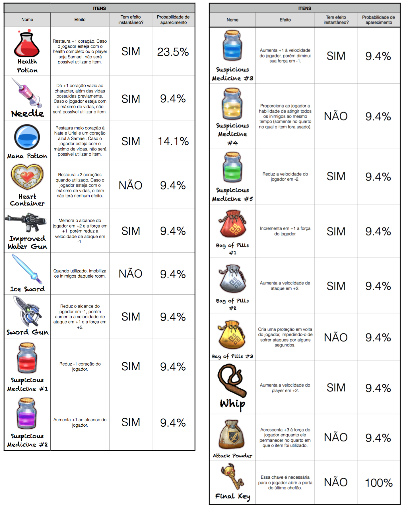

## The Limbo
**By [Amanda Fernandes](https://github.com/amandafer/)** 
*Federal University of Minas Gerais, 2016.*

*The Limbo is a game based on Binding of Isacc. It was developed using Unity 3D and the characters designed using Inkscape.*

### Table of Contents
[navbar]
* [Home](index.html)
* [Page1](page1.html)
* [Page2](page1.html)
[/navbar]
1. [Introduction](#introduction-)
  1. [How to Play](#download-)
  2. [About](#about-)
2. [Characters](#characters-)
  1. [Main Characters](#main-characters-)
  2. [Bosses](#bosses-)
  3. [Enemies](#enemies-)
3. [Items](#items)

### Introduction 
#### How to Play 
This game is available for MacOS and Windows x86 and x64. To download go to the folder /Limbo Downloads/ and download the file correspondent to your architecture.

After the download, double click at the .zip file and follow the instructions below:

* Mac OS: Unzip the file named “Limbo_MacOS”. The game application will appear, double tap at it to play it. The configuration window will appear, choose a resolution and wanted format. Click "Play" to start the game.

* Windows: Unzip the file name “Limbo_Windons(architecture)”. Click on the executable (.exe) twice and a configuration window will appear. Choose a resolution and wanted format. Click "Play" to start the game.

#### About 

### Characters 
#### Main Characters 
#### Bosses 
#### Enemies 

### Items 
The list below shows each item that can be found in the game. The second column describes the effect caused by the item. The third one the type of effect and the last one the probability of the item to appear.

